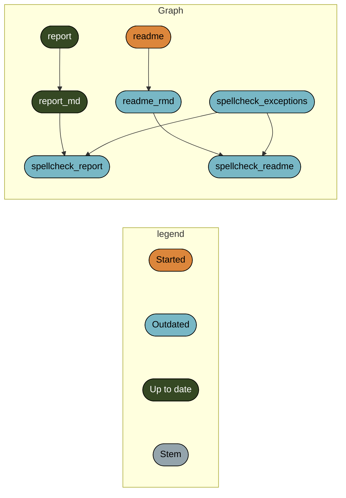

# Supplement to *Bayes Factors for Mixed Models: Perspective on Responses*

**Frederik Aust & Julia M. Haaf**

This repository contains research products associated with the
publication. We provide a Dockerfile, R scripts, and a Quarto document
to reproduce the reported simulations. The Quarto document in the
`reports` directory and the `_targets_*.R` scripts contain details about
reported simulations and can be used to reproduce the results. With the
help of [Quarto](https://quarto.org/) the `.qmd`-file can be rendered
into a report of the simulation results in HTML format.

## Recommended citation

van Doorn et al. (in prep). Bayes Factors for Mixed Models: Perspective
on Responses. *Computational Brain & Behavior*.

## Software requirements

The required software is detailed in the `DESCRIPTION` file.

To run the Docker container, execute `_run_docker.sh`,
e.g. `sh _run_docker.sh` in the terminal. This will recreate the
software environment used to run the simulation. The environment can be
interacted with in an RStudio instance in a web browser that will open
automatically.

## `targets` pipelines

The simulations were run using reproducible pipelines defined with the
`targets` package. To run the pipeline execute `_make.sh`,
e.g. `sh _make.sh` in the terminal. This project contains three separate
but interdependent pipelines

### Partial aggregation simulation

\`\`\`mermaidchecked: 108 \| outdated: 0checked: 202 \| outdated: 0  
graph LR subgraph legend x7420bd9270f8d27d(\[““Up to
date””\]):::uptodate — x70a5fa6bea6f298d\[““Pattern””\]:::none
x70a5fa6bea6f298d\[““Pattern””\]:::none —
xbf4603d6c2c2ad6b(\[““Stem””\]):::none
xbf4603d6c2c2ad6b(\[““Stem””\]):::none —
xf0bce276fe2b9d3e\>““Function”“\]:::none end subgraph Graph
x1771563b5781393f\>”get_trial_batches”\]:::uptodate –\>
x8a751a0886aa2602\>“sim_quantile_data”\]:::uptodate
x8ecaf1a2a7523541(\[“mu”\]):::uptodate –\>
xc85e4fa463404428\[“agg_data_quant_i”\]:::uptodate
xeaf79493baa34293(\[“n_s”\]):::uptodate –\>
xc85e4fa463404428\[“agg_data_quant_i”\]:::uptodate
x4ee98ffbc71ab023(\[“n_t”\]):::uptodate –\>
xc85e4fa463404428\[“agg_data_quant_i”\]:::uptodate
xcfeaac96e46ae15c(\[“nu”\]):::uptodate –\>
xc85e4fa463404428\[“agg_data_quant_i”\]:::uptodate
x05371c389fb4518e(\[“sigma_alpha”\]):::uptodate –\>
xc85e4fa463404428\[“agg_data_quant_i”\]:::uptodate
xba2e1f1771eddea4(\[“sigma_epsilon”\]):::uptodate –\>
xc85e4fa463404428\[“agg_data_quant_i”\]:::uptodate
x738f2179468d4542(\[“sigma_theta”\]):::uptodate –\>
xc85e4fa463404428\[“agg_data_quant_i”\]:::uptodate
x8a751a0886aa2602\>“sim_quantile_data”\]:::uptodate –\>
xc85e4fa463404428\[“agg_data_quant_i”\]:::uptodate
xc85e4fa463404428\[“agg_data_quant_i”\]:::uptodate –\>
xcb91d1ebc306c972\[“adjusted_prior”\]:::uptodate
x87c5d2c5d660b8d8(\[“max_n\_t”\]):::uptodate –\>
xcb91d1ebc306c972\[“adjusted_prior”\]:::uptodate
xc00972da323753cf(\[“min_n\_s”\]):::uptodate –\>
xcb91d1ebc306c972\[“adjusted_prior”\]:::uptodate
xcfeaac96e46ae15c(\[“nu”\]):::uptodate –\>
xcb91d1ebc306c972\[“adjusted_prior”\]:::uptodate
xba2e1f1771eddea4(\[“sigma_epsilon”\]):::uptodate –\>
xcb91d1ebc306c972\[“adjusted_prior”\]:::uptodate
x738f2179468d4542(\[“sigma_theta”\]):::uptodate –\>
xcb91d1ebc306c972\[“adjusted_prior”\]:::uptodate
xcff8cdcbc9dca5a6(\[“trial_batches”\]):::uptodate –\>
xcb91d1ebc306c972\[“adjusted_prior”\]:::uptodate
xeaf79493baa34293(\[“n_s”\]):::uptodate –\>
xcb91d1ebc306c972\[“adjusted_prior”\]:::uptodate
x4ee98ffbc71ab023(\[“n_t”\]):::uptodate –\>
xcb91d1ebc306c972\[“adjusted_prior”\]:::uptodate
x8ecaf1a2a7523541(\[“mu”\]):::uptodate –\>
xcb91d1ebc306c972\[“adjusted_prior”\]:::uptodate
x05371c389fb4518e(\[“sigma_alpha”\]):::uptodate –\>
xcb91d1ebc306c972\[“adjusted_prior”\]:::uptodate
xc85e4fa463404428\[“agg_data_quant_i”\]:::uptodate –\>
x9b971e52861a8a7e\[“constant_prior”\]:::uptodate
xc00972da323753cf(\[“min_n\_s”\]):::uptodate –\>
x9b971e52861a8a7e\[“constant_prior”\]:::uptodate
xcfeaac96e46ae15c(\[“nu”\]):::uptodate –\>
x9b971e52861a8a7e\[“constant_prior”\]:::uptodate
xba2e1f1771eddea4(\[“sigma_epsilon”\]):::uptodate –\>
x9b971e52861a8a7e\[“constant_prior”\]:::uptodate
x738f2179468d4542(\[“sigma_theta”\]):::uptodate –\>
x9b971e52861a8a7e\[“constant_prior”\]:::uptodate
xcff8cdcbc9dca5a6(\[“trial_batches”\]):::uptodate –\>
x9b971e52861a8a7e\[“constant_prior”\]:::uptodate
xeaf79493baa34293(\[“n_s”\]):::uptodate –\>
x9b971e52861a8a7e\[“constant_prior”\]:::uptodate
x4ee98ffbc71ab023(\[“n_t”\]):::uptodate –\>
x9b971e52861a8a7e\[“constant_prior”\]:::uptodate
x8ecaf1a2a7523541(\[“mu”\]):::uptodate –\>
x9b971e52861a8a7e\[“constant_prior”\]:::uptodate
x05371c389fb4518e(\[“sigma_alpha”\]):::uptodate –\>
x9b971e52861a8a7e\[“constant_prior”\]:::uptodate
xcb91d1ebc306c972\[“adjusted_prior”\]:::uptodate –\>
x90a3dd67ac8c7d0c(\[“agg_plot”\]):::uptodate
x9b971e52861a8a7e\[“constant_prior”\]:::uptodate –\>
x90a3dd67ac8c7d0c(\[“agg_plot”\]):::uptodate
x87c5d2c5d660b8d8(\[“max_n\_t”\]):::uptodate –\>
x90a3dd67ac8c7d0c(\[“agg_plot”\]):::uptodate
xc00972da323753cf(\[“min_n\_s”\]):::uptodate –\>
x90a3dd67ac8c7d0c(\[“agg_plot”\]):::uptodate
x4ee98ffbc71ab023(\[“n_t”\]):::uptodate –\>
x90a3dd67ac8c7d0c(\[“agg_plot”\]):::uptodate
xcfeaac96e46ae15c(\[“nu”\]):::uptodate –\>
x90a3dd67ac8c7d0c(\[“agg_plot”\]):::uptodate
x738f2179468d4542(\[“sigma_theta”\]):::uptodate –\>
x90a3dd67ac8c7d0c(\[“agg_plot”\]):::uptodate
x1771563b5781393f\>“get_trial_batches”\]:::uptodate –\>
xcff8cdcbc9dca5a6(\[“trial_batches”\]):::uptodate
x4ee98ffbc71ab023(\[“n_t”\]):::uptodate –\>
xcff8cdcbc9dca5a6(\[“trial_batches”\]):::uptodate
x8c8574439c0fb002\>“sim_data”\]:::uptodate –\>
x8c8574439c0fb002\>“sim_data”\]:::uptodate end classDef uptodate
stroke:#000000,color:#ffffff,fill:#354823; classDef none
stroke:#000000,color:#000000,fill:#94a4ac; linkStyle 0 stroke-width:0px;
linkStyle 1 stroke-width:0px; linkStyle 2 stroke-width:0px; linkStyle 42
stroke-width:0px;


    ### Full aggregation simulation

    ```mermaidchecked: 9 | outdated: 0checked: 107 | outdated: 0checked: 217 | outdated: 0checked: 324 | outdated: 0checked: 429 | outdated: 0checked: 531 | outdated: 0checked: 635 | outdated: 0checked: 742 | outdated: 0checked: 846 | outdated: 0checked: 953 | outdated: 0checked: 1058 | outdated: 0checked: 1166 | outdated: 0checked: 1272 | outdated: 0checked: 1379 | outdated: 0checked: 1486 | outdated: 0checked: 1580 | outdated: 0checked: 1684 | outdated: 0checked: 1788 | outdated: 0checked: 1810 | outdated: 0checked: 1930 | outdated: 0checked: 2046 | outdated: 0checked: 2161 | outdated: 0checked: 2276 | outdated: 0checked: 2394 | outdated: 0checked: 2508 | outdated: 0checked: 2623 | outdated: 0checked: 2742 | outdated: 0checked: 2860 | outdated: 0checked: 2976 | outdated: 0checked: 3093 | outdated: 0checked: 3208 | outdated: 0checked: 3325 | outdated: 0checked: 3441 | outdated: 0checked: 3559 | outdated: 0checked: 3611 | outdated: 0checked: 3729 | outdated: 0checked: 3845 | outdated: 0checked: 3964 | outdated: 0checked: 4080 | outdated: 0checked: 4108 | outdated: 0checked: 4225 | outdated: 0checked: 4344 | outdated: 0checked: 4463 | outdated: 0checked: 4580 | outdated: 0checked: 4700 | outdated: 0checked: 4820 | outdated: 0checked: 4934 | outdated: 0checked: 5053 | outdated: 0checked: 5174 | outdated: 0checked: 5292 | outdated: 0checked: 5411 | outdated: 0checked: 5434 | outdated: 0checked: 5537 | outdated: 0checked: 5643 | outdated: 0checked: 5749 | outdated: 0checked: 5854 | outdated: 0checked: 5960 | outdated: 0checked: 6065 | outdated: 0checked: 6171 | outdated: 0checked: 6275 | outdated: 0checked: 6381 | outdated: 0checked: 6486 | outdated: 0checked: 6581 | outdated: 0checked: 6680 | outdated: 0checked: 6784 | outdated: 0checked: 6886 | outdated: 0checked: 6986 | outdated: 0checked: 7091 | outdated: 0checked: 7197 | outdated: 0checked: 7223 | outdated: 0checked: 7334 | outdated: 0checked: 7447 | outdated: 0checked: 7559 | outdated: 0checked: 7663 | outdated: 0checked: 7775 | outdated: 0checked: 7885 | outdated: 0checked: 7999 | outdated: 0checked: 8108 | outdated: 0checked: 8215 | outdated: 0checked: 8322 | outdated: 0checked: 8434 | outdated: 0checked: 8547 | outdated: 0checked: 8660 | outdated: 0checked: 8762 | outdated: 0checked: 8875 | outdated: 0checked: 8987 | outdated: 0checked: 9020 | outdated: 4checked: 9120 | outdated: 4checked: 9222 | outdated: 4checked: 9322 | outdated: 4checked: 9420 | outdated: 4checked: 9521 | outdated: 4checked: 9622 | outdated: 4checked: 9721 | outdated: 4checked: 9823 | outdated: 4checked: 9922 | outdated: 4checked: 10018 | outdated: 4checked: 10118 | outdated: 4checked: 10220 | outdated: 4checked: 10319 | outdated: 4checked: 10419 | outdated: 4checked: 10509 | outdated: 4checked: 10606 | outdated: 4checked: 10701 | outdated: 4checked: 10797 | outdated: 4                                                                               
    graph LR
      subgraph legend
        x7420bd9270f8d27d([""Up to date""]):::uptodate --- x0a52b03877696646([""Outdated""]):::outdated
        x0a52b03877696646([""Outdated""]):::outdated --- x70a5fa6bea6f298d[""Pattern""]:::none
        x70a5fa6bea6f298d[""Pattern""]:::none --- xbf4603d6c2c2ad6b([""Stem""]):::none
        xbf4603d6c2c2ad6b([""Stem""]):::none --- x5bffbffeae195fc9{{""Object""}}:::none
        x5bffbffeae195fc9{{""Object""}}:::none --- xf0bce276fe2b9d3e>""Function""]:::none
      end
      subgraph Graph
        xb115d6582cfd771d{{"default_scales"}}:::outdated --> xe86e0eb83252331d>"logbf_plot"]:::outdated
        xb115d6582cfd771d{{"default_scales"}}:::outdated --> xcdb2dd46db4ed9e6>"logbf_summary_plot"]:::outdated
        x98aca552ca5e76e9{{"default_theme"}}:::uptodate --> xe86e0eb83252331d>"logbf_plot"]:::outdated
        x98aca552ca5e76e9{{"default_theme"}}:::uptodate --> xcdb2dd46db4ed9e6>"logbf_summary_plot"]:::outdated
        x98aca552ca5e76e9{{"default_theme"}}:::uptodate --> x061b7c77ec2aea53>"logbf_trend_plot"]:::uptodate
        x1771563b5781393f>"get_trial_batches"]:::uptodate --> x8a751a0886aa2602>"sim_quantile_data"]:::uptodate
        x329b0a648be700a4["anova_bf"]:::uptodate --> x944705ecb5bda702(["ttest_anova_plot"]):::outdated
        xe86e0eb83252331d>"logbf_plot"]:::outdated --> x944705ecb5bda702(["ttest_anova_plot"]):::outdated
        xeaf79493baa34293(["n_s"]):::uptodate --> x944705ecb5bda702(["ttest_anova_plot"]):::outdated
        x4df3f0b4865e9d1f["ttest_bf"]:::uptodate --> x944705ecb5bda702(["ttest_anova_plot"]):::outdated
        x4abc4a40bd190013["lm_bf"]:::uptodate --> x73752a944d421f45(["lm_ttest_trend_plot"]):::uptodate
        x061b7c77ec2aea53>"logbf_trend_plot"]:::uptodate --> x73752a944d421f45(["lm_ttest_trend_plot"]):::uptodate
        xeaf79493baa34293(["n_s"]):::uptodate --> x73752a944d421f45(["lm_ttest_trend_plot"]):::uptodate
        x4df3f0b4865e9d1f["ttest_bf"]:::uptodate --> x73752a944d421f45(["lm_ttest_trend_plot"]):::uptodate
        x4abc4a40bd190013["lm_bf"]:::uptodate --> x48f0f510e049f6d0(["lm_ttest_summary_zoom_plot"]):::outdated
        xcdb2dd46db4ed9e6>"logbf_summary_plot"]:::outdated --> x48f0f510e049f6d0(["lm_ttest_summary_zoom_plot"]):::outdated
        xeaf79493baa34293(["n_s"]):::uptodate --> x48f0f510e049f6d0(["lm_ttest_summary_zoom_plot"]):::outdated
        x4df3f0b4865e9d1f["ttest_bf"]:::uptodate --> x48f0f510e049f6d0(["lm_ttest_summary_zoom_plot"]):::outdated
        x1615e86a4352b497{{"zoom_scales"}}:::outdated --> x48f0f510e049f6d0(["lm_ttest_summary_zoom_plot"]):::outdated
        x90c50cbdfe0d5b74(["lm_anova_logbf"]):::uptodate --> x8d899f6d5b476a5c(["lm_anova_corrected_summary_plot"]):::outdated
        xcdb2dd46db4ed9e6>"logbf_summary_plot"]:::outdated --> x8d899f6d5b476a5c(["lm_anova_corrected_summary_plot"]):::outdated
        xeaf79493baa34293(["n_s"]):::uptodate --> x8d899f6d5b476a5c(["lm_anova_corrected_summary_plot"]):::outdated
        x329b0a648be700a4["anova_bf"]:::uptodate --> xee8c11d2796b1550(["ttest_anova_trend_plot"]):::uptodate
        x061b7c77ec2aea53>"logbf_trend_plot"]:::uptodate --> xee8c11d2796b1550(["ttest_anova_trend_plot"]):::uptodate
        xeaf79493baa34293(["n_s"]):::uptodate --> xee8c11d2796b1550(["ttest_anova_trend_plot"]):::uptodate
        x4df3f0b4865e9d1f["ttest_bf"]:::uptodate --> xee8c11d2796b1550(["ttest_anova_trend_plot"]):::uptodate
        x6dc4618e710ead06>"correct_bf"]:::uptodate --> xa00237f46a787f98(["lm_ttest_logbf"]):::uptodate
        x4abc4a40bd190013["lm_bf"]:::uptodate --> xa00237f46a787f98(["lm_ttest_logbf"]):::uptodate
        x4df3f0b4865e9d1f["ttest_bf"]:::uptodate --> xa00237f46a787f98(["lm_ttest_logbf"]):::uptodate
        x3eacaf6486c5145a["data_i"]:::uptodate --> x4abc4a40bd190013["lm_bf"]:::uptodate
        xeaf79493baa34293(["n_s"]):::uptodate --> x4abc4a40bd190013["lm_bf"]:::uptodate
        x4ee98ffbc71ab023(["n_t"]):::uptodate --> x4abc4a40bd190013["lm_bf"]:::uptodate
        xcfeaac96e46ae15c(["nu"]):::uptodate --> x4abc4a40bd190013["lm_bf"]:::uptodate
        xba2e1f1771eddea4(["sigma_epsilon"]):::uptodate --> x4abc4a40bd190013["lm_bf"]:::uptodate
        x04e94ee208381956(["index"]):::uptodate --> x4abc4a40bd190013["lm_bf"]:::uptodate
        x329b0a648be700a4["anova_bf"]:::uptodate --> xd25aaa181d8c75c7(["ttest_anova_large_n_plot"]):::outdated
        xe86e0eb83252331d>"logbf_plot"]:::outdated --> xd25aaa181d8c75c7(["ttest_anova_large_n_plot"]):::outdated
        xeaf79493baa34293(["n_s"]):::uptodate --> xd25aaa181d8c75c7(["ttest_anova_large_n_plot"]):::outdated
        x4df3f0b4865e9d1f["ttest_bf"]:::uptodate --> xd25aaa181d8c75c7(["ttest_anova_large_n_plot"]):::outdated
        x329b0a648be700a4["anova_bf"]:::uptodate --> x42a633d7a3b0e034(["lm_anova_plot"]):::outdated
        x4abc4a40bd190013["lm_bf"]:::uptodate --> x42a633d7a3b0e034(["lm_anova_plot"]):::outdated
        xe86e0eb83252331d>"logbf_plot"]:::outdated --> x42a633d7a3b0e034(["lm_anova_plot"]):::outdated
        xeaf79493baa34293(["n_s"]):::uptodate --> x42a633d7a3b0e034(["lm_anova_plot"]):::outdated
        x329b0a648be700a4["anova_bf"]:::uptodate --> xbdb1bb9d427ff5ca(["lm_anova_summary_plot"]):::outdated
        x4abc4a40bd190013["lm_bf"]:::uptodate --> xbdb1bb9d427ff5ca(["lm_anova_summary_plot"]):::outdated
        xcdb2dd46db4ed9e6>"logbf_summary_plot"]:::outdated --> xbdb1bb9d427ff5ca(["lm_anova_summary_plot"]):::outdated
        xeaf79493baa34293(["n_s"]):::uptodate --> xbdb1bb9d427ff5ca(["lm_anova_summary_plot"]):::outdated
        x8ecaf1a2a7523541(["mu"]):::uptodate --> x3eacaf6486c5145a["data_i"]:::uptodate
        xeaf79493baa34293(["n_s"]):::uptodate --> x3eacaf6486c5145a["data_i"]:::uptodate
        x4ee98ffbc71ab023(["n_t"]):::uptodate --> x3eacaf6486c5145a["data_i"]:::uptodate
        xcfeaac96e46ae15c(["nu"]):::uptodate --> x3eacaf6486c5145a["data_i"]:::uptodate
        x05371c389fb4518e(["sigma_alpha"]):::uptodate --> x3eacaf6486c5145a["data_i"]:::uptodate
        xba2e1f1771eddea4(["sigma_epsilon"]):::uptodate --> x3eacaf6486c5145a["data_i"]:::uptodate
        x738f2179468d4542(["sigma_theta"]):::uptodate --> x3eacaf6486c5145a["data_i"]:::uptodate
        x8c8574439c0fb002>"sim_data"]:::uptodate --> x3eacaf6486c5145a["data_i"]:::uptodate
        x04e94ee208381956(["index"]):::uptodate --> x3eacaf6486c5145a["data_i"]:::uptodate
        x329b0a648be700a4["anova_bf"]:::uptodate --> x90c50cbdfe0d5b74(["lm_anova_logbf"]):::uptodate
        x6dc4618e710ead06>"correct_bf"]:::uptodate --> x90c50cbdfe0d5b74(["lm_anova_logbf"]):::uptodate
        x4abc4a40bd190013["lm_bf"]:::uptodate --> x90c50cbdfe0d5b74(["lm_anova_logbf"]):::uptodate
        x4abc4a40bd190013["lm_bf"]:::uptodate --> x4ad37dca8e198589(["lm_ttest_summary_plot"]):::outdated
        xcdb2dd46db4ed9e6>"logbf_summary_plot"]:::outdated --> x4ad37dca8e198589(["lm_ttest_summary_plot"]):::outdated
        xeaf79493baa34293(["n_s"]):::uptodate --> x4ad37dca8e198589(["lm_ttest_summary_plot"]):::outdated
        x4df3f0b4865e9d1f["ttest_bf"]:::uptodate --> x4ad37dca8e198589(["lm_ttest_summary_plot"]):::outdated
        x4abc4a40bd190013["lm_bf"]:::uptodate --> xd48b8f6329d5f74b(["lm_ttest_large_n_plot"]):::outdated
        xe86e0eb83252331d>"logbf_plot"]:::outdated --> xd48b8f6329d5f74b(["lm_ttest_large_n_plot"]):::outdated
        xeaf79493baa34293(["n_s"]):::uptodate --> xd48b8f6329d5f74b(["lm_ttest_large_n_plot"]):::outdated
        x4df3f0b4865e9d1f["ttest_bf"]:::uptodate --> xd48b8f6329d5f74b(["lm_ttest_large_n_plot"]):::outdated
        x329b0a648be700a4["anova_bf"]:::uptodate --> x5d09d4146c534948(["lm_anova_large_n_plot"]):::outdated
        x4abc4a40bd190013["lm_bf"]:::uptodate --> x5d09d4146c534948(["lm_anova_large_n_plot"]):::outdated
        xe86e0eb83252331d>"logbf_plot"]:::outdated --> x5d09d4146c534948(["lm_anova_large_n_plot"]):::outdated
        xeaf79493baa34293(["n_s"]):::uptodate --> x5d09d4146c534948(["lm_anova_large_n_plot"]):::outdated
        x329b0a648be700a4["anova_bf"]:::uptodate --> xf3f0d890f356316a(["lm_anova_summary_zoom_plot"]):::outdated
        x4abc4a40bd190013["lm_bf"]:::uptodate --> xf3f0d890f356316a(["lm_anova_summary_zoom_plot"]):::outdated
        xcdb2dd46db4ed9e6>"logbf_summary_plot"]:::outdated --> xf3f0d890f356316a(["lm_anova_summary_zoom_plot"]):::outdated
        xeaf79493baa34293(["n_s"]):::uptodate --> xf3f0d890f356316a(["lm_anova_summary_zoom_plot"]):::outdated
        x1615e86a4352b497{{"zoom_scales"}}:::outdated --> xf3f0d890f356316a(["lm_anova_summary_zoom_plot"]):::outdated
        xa00237f46a787f98(["lm_ttest_logbf"]):::uptodate --> xfea49e8d3c6cf504(["lm_ttest_corrected_summary_zoom_plot"]):::outdated
        xcdb2dd46db4ed9e6>"logbf_summary_plot"]:::outdated --> xfea49e8d3c6cf504(["lm_ttest_corrected_summary_zoom_plot"]):::outdated
        xeaf79493baa34293(["n_s"]):::uptodate --> xfea49e8d3c6cf504(["lm_ttest_corrected_summary_zoom_plot"]):::outdated
        x1615e86a4352b497{{"zoom_scales"}}:::outdated --> xfea49e8d3c6cf504(["lm_ttest_corrected_summary_zoom_plot"]):::outdated
        xa821325e87eea2da["agg_diff_data_i"]:::uptodate --> x4df3f0b4865e9d1f["ttest_bf"]:::uptodate
        xeaf79493baa34293(["n_s"]):::uptodate --> x4df3f0b4865e9d1f["ttest_bf"]:::uptodate
        x4ee98ffbc71ab023(["n_t"]):::uptodate --> x4df3f0b4865e9d1f["ttest_bf"]:::uptodate
        xcfeaac96e46ae15c(["nu"]):::uptodate --> x4df3f0b4865e9d1f["ttest_bf"]:::uptodate
        xba2e1f1771eddea4(["sigma_epsilon"]):::uptodate --> x4df3f0b4865e9d1f["ttest_bf"]:::uptodate
        x738f2179468d4542(["sigma_theta"]):::uptodate --> x4df3f0b4865e9d1f["ttest_bf"]:::uptodate
        x04e94ee208381956(["index"]):::uptodate --> x4df3f0b4865e9d1f["ttest_bf"]:::uptodate
        x329b0a648be700a4["anova_bf"]:::uptodate --> xebd5d8d40a900838(["ttest_anova_summary_zoom_plot"]):::outdated
        xcdb2dd46db4ed9e6>"logbf_summary_plot"]:::outdated --> xebd5d8d40a900838(["ttest_anova_summary_zoom_plot"]):::outdated
        xeaf79493baa34293(["n_s"]):::uptodate --> xebd5d8d40a900838(["ttest_anova_summary_zoom_plot"]):::outdated
        x4df3f0b4865e9d1f["ttest_bf"]:::uptodate --> xebd5d8d40a900838(["ttest_anova_summary_zoom_plot"]):::outdated
        x1615e86a4352b497{{"zoom_scales"}}:::outdated --> xebd5d8d40a900838(["ttest_anova_summary_zoom_plot"]):::outdated
        x329b0a648be700a4["anova_bf"]:::uptodate --> x1eebc08898fd99b5(["lm_anova_trend_plot"]):::uptodate
        x4abc4a40bd190013["lm_bf"]:::uptodate --> x1eebc08898fd99b5(["lm_anova_trend_plot"]):::uptodate
        x061b7c77ec2aea53>"logbf_trend_plot"]:::uptodate --> x1eebc08898fd99b5(["lm_anova_trend_plot"]):::uptodate
        xeaf79493baa34293(["n_s"]):::uptodate --> x1eebc08898fd99b5(["lm_anova_trend_plot"]):::uptodate
        x329b0a648be700a4["anova_bf"]:::uptodate --> xe04d9407c0f16f0c(["ttest_anova_summary_plot"]):::outdated
        xcdb2dd46db4ed9e6>"logbf_summary_plot"]:::outdated --> xe04d9407c0f16f0c(["ttest_anova_summary_plot"]):::outdated
        xeaf79493baa34293(["n_s"]):::uptodate --> xe04d9407c0f16f0c(["ttest_anova_summary_plot"]):::outdated
        x4df3f0b4865e9d1f["ttest_bf"]:::uptodate --> xe04d9407c0f16f0c(["ttest_anova_summary_plot"]):::outdated
        x4abc4a40bd190013["lm_bf"]:::uptodate --> xbd6d9ed6586d7827(["lm_ttest_plot"]):::outdated
        xe86e0eb83252331d>"logbf_plot"]:::outdated --> xbd6d9ed6586d7827(["lm_ttest_plot"]):::outdated
        xeaf79493baa34293(["n_s"]):::uptodate --> xbd6d9ed6586d7827(["lm_ttest_plot"]):::outdated
        x4df3f0b4865e9d1f["ttest_bf"]:::uptodate --> xbd6d9ed6586d7827(["lm_ttest_plot"]):::outdated
        x90c50cbdfe0d5b74(["lm_anova_logbf"]):::uptodate --> x35140ed3954b9c98(["lm_anova_corrected_summary_zoom_plot"]):::outdated
        xcdb2dd46db4ed9e6>"logbf_summary_plot"]:::outdated --> x35140ed3954b9c98(["lm_anova_corrected_summary_zoom_plot"]):::outdated
        xeaf79493baa34293(["n_s"]):::uptodate --> x35140ed3954b9c98(["lm_anova_corrected_summary_zoom_plot"]):::outdated
        x1615e86a4352b497{{"zoom_scales"}}:::outdated --> x35140ed3954b9c98(["lm_anova_corrected_summary_zoom_plot"]):::outdated
        x4132bef5cada5de0["agg_data_i"]:::uptodate --> xa821325e87eea2da["agg_diff_data_i"]:::uptodate
        x4132bef5cada5de0["agg_data_i"]:::uptodate --> x329b0a648be700a4["anova_bf"]:::uptodate
        xeaf79493baa34293(["n_s"]):::uptodate --> x329b0a648be700a4["anova_bf"]:::uptodate
        x4ee98ffbc71ab023(["n_t"]):::uptodate --> x329b0a648be700a4["anova_bf"]:::uptodate
        xcfeaac96e46ae15c(["nu"]):::uptodate --> x329b0a648be700a4["anova_bf"]:::uptodate
        xba2e1f1771eddea4(["sigma_epsilon"]):::uptodate --> x329b0a648be700a4["anova_bf"]:::uptodate
        x738f2179468d4542(["sigma_theta"]):::uptodate --> x329b0a648be700a4["anova_bf"]:::uptodate
        x04e94ee208381956(["index"]):::uptodate --> x329b0a648be700a4["anova_bf"]:::uptodate
        xa00237f46a787f98(["lm_ttest_logbf"]):::uptodate --> x926ff8e74f68255b(["lm_ttest_corrected_summary_plot"]):::outdated
        xcdb2dd46db4ed9e6>"logbf_summary_plot"]:::outdated --> x926ff8e74f68255b(["lm_ttest_corrected_summary_plot"]):::outdated
        xeaf79493baa34293(["n_s"]):::uptodate --> x926ff8e74f68255b(["lm_ttest_corrected_summary_plot"]):::outdated
        x3eacaf6486c5145a["data_i"]:::uptodate --> x4132bef5cada5de0["agg_data_i"]:::uptodate
        xd51e323eb90213dd{{"project_packages"}}:::uptodate --> xd51e323eb90213dd{{"project_packages"}}:::uptodate
      end
      classDef uptodate stroke:#000000,color:#ffffff,fill:#354823;
      classDef outdated stroke:#000000,color:#000000,fill:#78B7C5;
      classDef none stroke:#000000,color:#000000,fill:#94a4ac;
      linkStyle 0 stroke-width:0px;
      linkStyle 1 stroke-width:0px;
      linkStyle 2 stroke-width:0px;
      linkStyle 3 stroke-width:0px;
      linkStyle 4 stroke-width:0px;
      linkStyle 125 stroke-width:0px;

### Report



## Simulation data

The `_targets*/objects` directories contain all (intermediary)
simulation results in `RDS`-format, which can be readily imported into R
using `targets::tar_load()` or `loadRDS()`.
